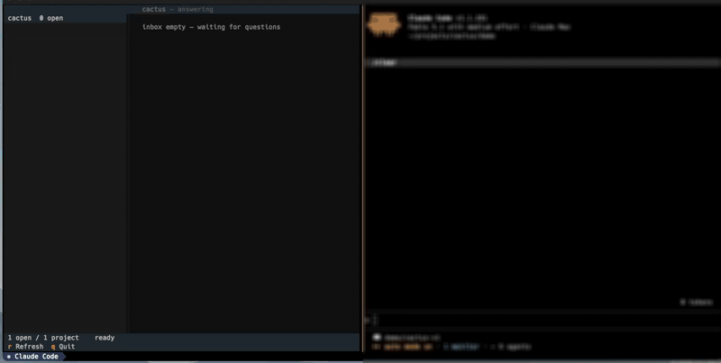

# cactus

"All the spines without the ouch"

[](https://youtu.be/kobgaU4_Tn0)

All your agents have lots of questions for you. Juggling agent windows and ingesting context is an OS-level user-interface concern. To bring order to it we need *primitives* and a *queue*: agents propose, users decide.

Conversational chat has been the dominant human<>AI surface for 50 years (ELIZA). `cactus` is a decision queue for humans working with conversational agents.

## Features

### async asks
Agents post to `cactus` before the final response is written. Steer behavior from the queue instead of speed-reading scrolling text.

### snip and run
Copy a row's command to the clipboard, or run it in the row's working directory; output streams to the card, the full log is kept.

### permissions
A command the agent is not allowed to run becomes an approve / deny row. Approve runs it and hands the exit code and output back to the agent.

### globally sliced
- one project is a stream
- multiple workers in a folder produce a single stream

### inputs
Free-text input is on by default, alongside any pick.

### elaborate
Kick the question back with an optional take; the agent rewrites it.

Press `D` to use that same workflow to decompose a complex question into
smaller follow-up questions. The agent posts the replacements, then retires
the original.

### view settings
Press `?` in the TUI to choose the question rail's layout: left of the detail
card, or underneath it. The same screen toggles a Figlet `cybermedium` project
header; it falls back to plain text when `figlet` is not installed.

It's honestly not that complicated, but it's replaced a number of my AI interactions.

## Manual Installation

```sh
uv tool install git+https://github.com/eighteyes/cactus     # the CLI: cactus, cac
cactus --tui                                                # answer the queue
```

### First class

**Claude Code**: plugin with skill, hooks, courier agent and a bundled `cactus` on `PATH`.

```
/plugin marketplace add eighteyes/cactus
/plugin install cactus@cactus
```

**Codex**: plugin at `plugins/cactus`: skill and hooks, with the Codex session id as the row owner. It ships no launcher, so install the CLI first. Setup: [skills/cactus/CODEX.md](skills/cactus/CODEX.md)

```sh
uv tool install git+https://github.com/eighteyes/cactus
codex plugin marketplace add eighteyes/cactus      # or a local checkout path
codex plugin add cactus@cactus-local
```

Codex does not trust plugin hooks automatically: review and trust them after installing.

**Grok**: no plugin; a webhook wakes the agent. Add the skill to Grok's shared skill library and map the agent id to a webhook. Setup: [skills/cactus/GROK.md](skills/cactus/GROK.md), [skills/cactus/WEBHOOK_SETUP.md](skills/cactus/WEBHOOK_SETUP.md)

```json
// ~/.config/cactus/poke-webhooks.json
{
  "grok-bot": {
    "url": "https://example.com/wake",
    "authorization": "Bearer …"
  }
}
```

```sh
cactus feed --json --agent grok-bot          # what the wake routine runs
```

### Incomplete Implementations

**Claude Desktop**: MCP tools only; no monitor, no hooks. Not very dynamic. Setup: [skills/cactus/DESKTOP.md](skills/cactus/DESKTOP.md)

```sh
scripts/package-plugin.sh          # writes dist/cactus-<version>.plugin
                                   # install: Settings > Plugins, or drop it on the window
```

Or register the server by absolute path in `claude_desktop_config.json`:

```json
{
  "mcpServers": {
    "cactus": {
      "command": "/abs/path/cactus/server/cactus-mcp",
      "env": { "CACTUS_AGENT": "claude-desktop", "CACTUS_PROJECT": "/abs/path/repo" }
    }
  }
}
```

## Implementation

### Hooks

```
hook               host          does
SessionStart       Claude Code   resolve identity; rehome rows after /clear; start-the-monitor line; open rows
                   Codex         session id as identity; start-the-monitor line
UserPromptSubmit   both          inject open and answered-but-unacted rows; name the monitor if none runs
Stop (opt-in)      Claude Code   hold a turn with open rows and no monitor; hold a turn that posted no ask
                   Codex         hold a turn with open rows and no monitor
PermissionDenied   Claude Code   post the denied command as a `cactus run` row
PermissionRequest  Codex         post the requested command as a `cactus run` row, decline the transient prompt
```

Stop is opt-in: set `CACTUS_STOP_HOOK=1`. Without it both Stop hooks exit silently.

### CLI

Humans:

```sh
cactus --tui          # answer the queue
cactus --watch        # read-only feed
cactus --www          # localhost web surface
```

Agents:

```sh
cactus --monitor --json --agent ID                     # before the first ask; keep it running
cactus ask "Which auth backend?" --agent ID \
  -c "oidc: existing IdP" -c "local: bcrypt table" \
  --recommend oidc --confidence med --context "Staging tenant exists."
cactus get q7 --json                                   # at the step that needs the answer
cactus run "make deploy" --agent ID --why "needs prod credentials"
cactus edit q7 --agent ID --context "…"                # answer an elaborate request
# TUI: D on q7 requests smaller follow-ups; agent asks them with -p q7, then clears q7
cactus plan q9 --step "write code" --step "test it" --done 1   # steps are 1-based
cactus review q9 --look-at "login form" --run "echo OK" --pass "prints OK" --fail "anything else"
cactus ask "Fix this file?" -f src/app.py -f README.md --agent ID   # attach files
cactus clear q7 --agent ID                             # once acted on
```

`f`/`F` in the TUI preview (pager) / edit (editor) a row's attached file; a
row with more than one arms a digit pick.

Full reference: `cactus --agent-help`.

### Skills / MCP / Subagent

An agentic runtime needs two things from its host: bash calls and a background process. The skill teaches the workflow over bash; `cactus --monitor` is the background process that wakes the agent. MCP is for Desktop, which has neither: `server/cactus-mcp` wraps the same verbs, and a client polls with `cactus_get`. The `cactus-courier` subagent parks on a thread in the background and reports when the human answers.

### Webhooks

For that weirdo Grok, and any agent that cannot hold a local monitor: map the agent id to a URL in `~/.config/cactus/poke-webhooks.json`; answering a row POSTs a wake. Schema and smoke test: [skills/cactus/WEBHOOK_SETUP.md](skills/cactus/WEBHOOK_SETUP.md)

## Contributions
Are welcome, I'm interested in seeing if this is useful! I've been thinking about out-of-band agentic communication for a while, and this is the approach that finally stuck.
